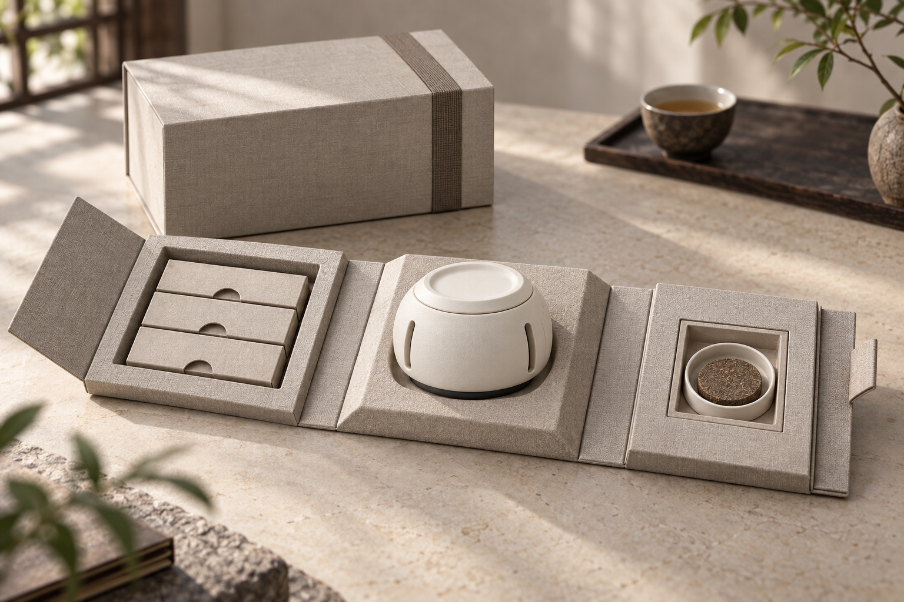
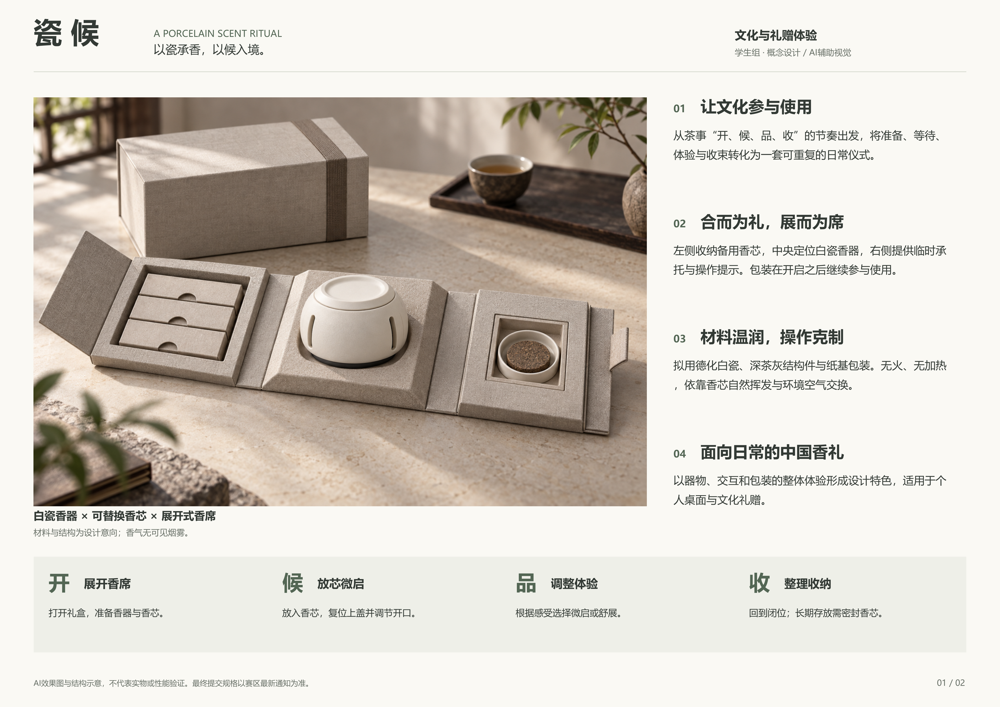
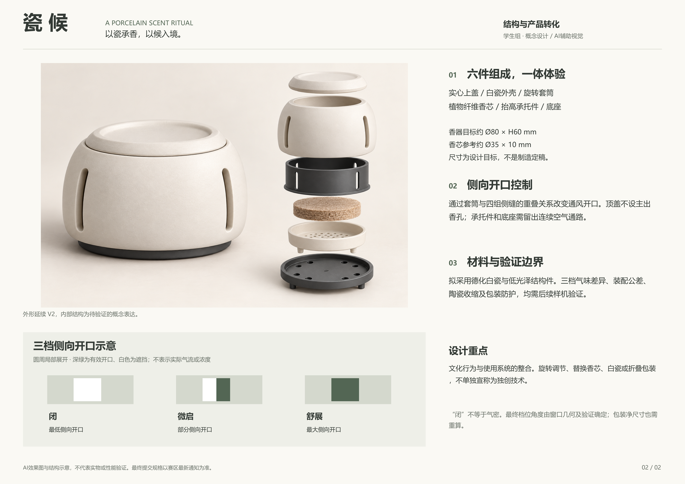

# 瓷候｜学生组概念设计

白瓷无火香礼系统 · A Porcelain Scent Ritual

《瓷候》由白瓷香器、可替换植物纤维香芯与展开式香席包装组成，从茶事中的“开、候、品、收”提取日常使用节奏。本目录接续原“茶与香”项目，保留历史版本，并以新增 **29–35 号文件**作为当前学生组图文方案入口。

**当前状态：学生组图文方案已整理完成；赛事规则核验、报名与正式提交尚未完成。**“瓷候”为暂定作品名，尚未完成名称权利检索。

## 当前主视觉

无火、无烟的概念效果图，用于表达外观、材质与包装使用关系。查看[结构概念效果图 V3](30_瓷候_结构概念效果图_V3.png)。

## 两页展示展板

[打开完整 PDF](31_瓷候_学生组展示展板_V1.pdf)

当前展板采用 A3 横向、两页、300 dpi，均为本次排版选择，尚未确认为赛区官方提交规格。

## 当前文件索引

| 文件 | 内容与用途 |
|---|---|
| [29 · 礼盒主视觉 V3](29_瓷候_礼盒主视觉_V3.png) | 香器、香芯与展开香席的整体概念表现 |
| [30 · 结构概念效果图 V3](30_瓷候_结构概念效果图_V3.png) | 可拆盖、壳体、套筒、香芯、承托件与底座的分件关系 |
| [31 · 学生组展示展板 PDF](31_瓷候_学生组展示展板_V1.pdf) | 两页图文展示稿；[第 1 页 PNG](31_瓷候_学生组展示展板_V1-1.png) / [第 2 页 PNG](31_瓷候_学生组展示展板_V1-2.png) |
| [32 · 参赛设计说明 V2](32_瓷候_参赛设计说明_V2.md) | 设计概念、使用流程、材料设想、短版与中版简介 |
| [33 · 结构问题复核与修订说明](33_瓷候_结构问题复核与修订说明.md) | 几何矛盾、包装余量、气路及尚待验证的问题 |
| [34 · 赛事对照与提交清单](34_瓷候_赛事对照与提交清单.md) | 基于现有赛事摘录的条件性核对与正式提交前待办 |
| [35 · AI 生成记录](35_瓷候_AI生成记录.md) | AI 辅助说明、生成提示词及参考图记录 |

## 本轮完成内容

- 已明确参赛方向为**学生组**，按图文概念方案整理当前材料。
- 新增两张 AI 效果图和两页独立编排展板，统一设计说明与使用流程。
- 修正旧图中的冒烟、穿过实心上盖的排香箭头，以及未经验证的三档角度表述。
- 将结构、包装、名称与相似性检索中的缺口列入复核文档，保留真实待验证状态。
- 保存 AI 辅助使用记录，供后续按赛区要求披露。

## 阅读结构图前请注意

**四组等间距开口具有 90° 周期性。**当外壳固定缝和旋转套筒窗口均按每 90° 重复布置时，有效重合面积满足 `A(θ + 90°) = A(θ)`。因此，不能直接把同一结构的 0° 定义为全闭、90° 定义为全开。当前展板只表达低、部分和最大侧向开口；实际旋转行程、定位及扩香差异仍待设计与测试。[查看几何说明](33_瓷候_结构问题复核与修订说明.md)。

“闭”表示降低侧向开口，不表示气密或停止挥发。底部通路、盖缘旁漏、陶瓷收缩、装配公差、香芯相容性与包装缓冲均尚待验证。

新增图像属于 **AI 概念视觉表达**，不构成 CAD、工程图、实物摄影、流体仿真或样机测试证据，不能按图像像素反推制造尺寸。设计重点在文化行为、器物、耗材及包装使用界面的整合；旋转调节、可换芯及折叠包装不单独宣称为已证实的独创技术。

## 正式提交前待办

- [ ] 确定赛区、准确主题、报名入口与截止时间。
- [ ] 取得最新官方技术文件，核对展板数量、尺寸、格式、匿名及命名要求。
- [ ] 核对学生组效果图要求及 AI 辅助使用、披露与创作过程证明规则。
- [ ] 补齐参赛人真实信息、学校与所需身份材料。
- [ ] 完善名称、同类产品及相关专利／外观检索，保存可追溯的来源、日期与比对记录。
- [ ] 核对作品权利条款，并按最终规格导出、复核和提交，保留回执。

当前赛事对照依据本地通知摘录，尚未获得本轮可核验的官方原文与完整赛区细则。当前材料不表示已通过赛事审核、名称或知识产权核查。

## 历史版本

01–28 号文件保留原“茶与香”至“瓷候”的方案、评审与结构探索过程。历史文件中的“锁版”“验证”等措辞应结合其原始证据阅读；AI 图及评审意见不能代替实物验证。旧资料与当前说明存在差异时，以 **32 号设计说明、33 号问题复核和 34 号提交清单**中的本轮修订与限制为准。
