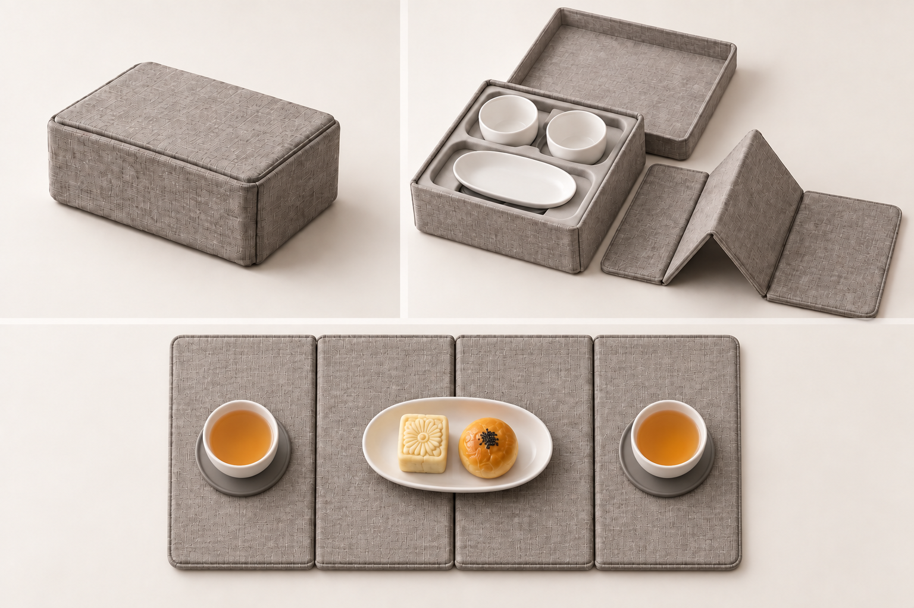

# 一席之间｜参赛效果图 V1

**席** · 待客礼序转为两人共同展开的奉茶空间。

本轮完成两张 1536×1024 PNG，使用内置 image_gen 生成。供学生组方案展示与展板排版使用，未包含赛事专属文字和标识。

## 产品主视觉

## 使用或结构概念

## 本轮设计决定

四折席面、两只低杯、一只分享碟、两只可清洗接水垫；使用外部已泡好的茶。本轮采用可取出的四折席面加独立礼盒与保护内托，替代“全部盒壁直接展开成席”的未解决构造。闭合尺寸、折叠堆叠和内托容积仍待尺寸设计。历史完整冲泡/残水仓版本不混用。

[完整提示词、迭代与逐图检查](生成记录.md)

[返回七题概念库](https://github.com/xym08/-AI-/tree/main/03_设计开发/04_中国礼物七题_第一轮概念库)

效果图表达设计意图，不作为实物、性能或知识产权验证证据。正式提交前按赛区要求排版并披露 AI 辅助使用。
