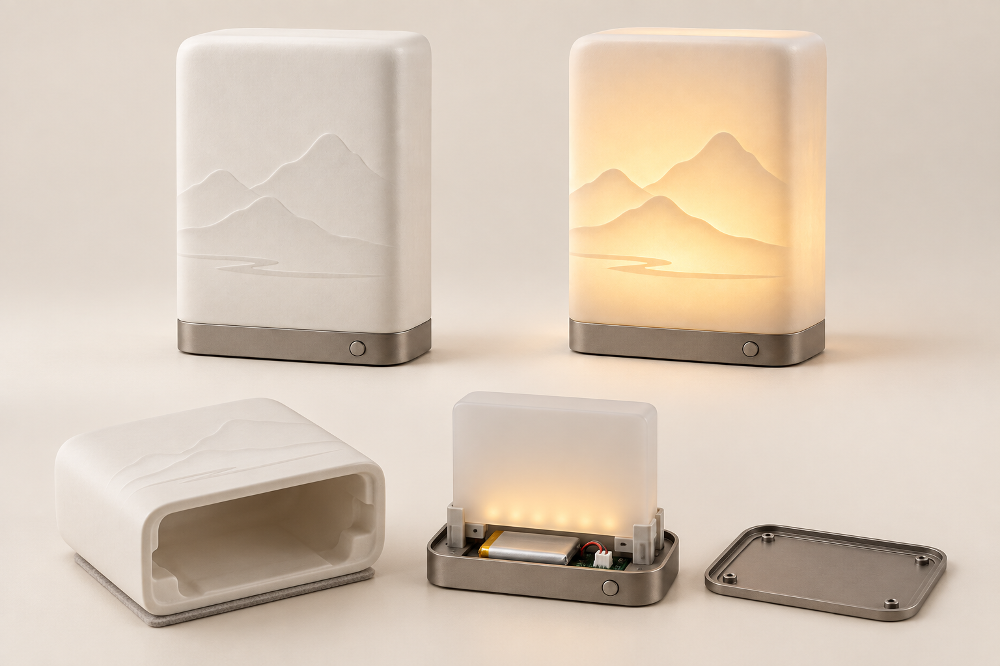

# 白瓷光笺｜参赛效果图 V1

**光** · 通过瓷壁厚薄与暖光，显现固定山水信息。

本轮完成两张 1536×1024 PNG，使用内置 image_gen 生成。供学生组方案展示与展板排版使用，未包含赛事专属文字和标识。

## 产品主视觉

## 使用或结构概念

## 本轮设计决定

一体白瓷罩、连续承托底座、固定山水图形、暖光扩散组件。关灯仍可见微弱肌理，点亮加强显影；不宣称动态换图或多级信息显现。电子件仅为布局概念，壁厚、烧成、温升、续航尚未测试。

[完整提示词、迭代与逐图检查](生成记录.md)

[返回七题概念库](https://github.com/xym08/-AI-/tree/main/03_设计开发/04_中国礼物七题_第一轮概念库)

效果图表达设计意图，不作为实物、性能或知识产权验证证据。正式提交前按赛区要求排版并披露 AI 辅助使用。
