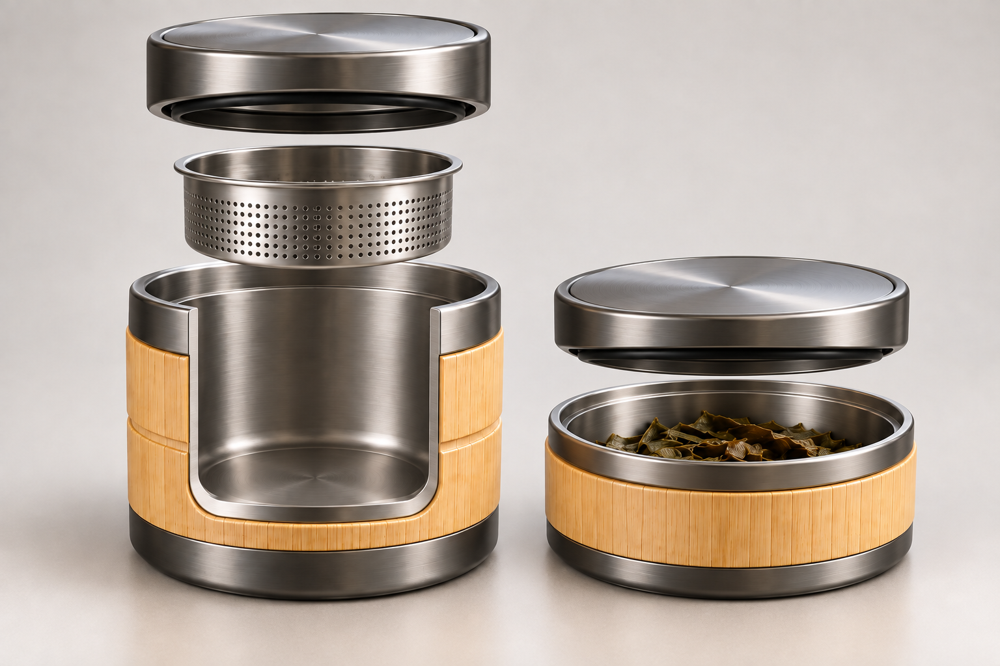

# 竹·行｜参赛效果图 V1

**行** · 把竹节转为分段收纳和模块识别。

本轮完成两张 1536×1024 PNG，使用内置 image_gen 生成。供学生组方案展示与展板排版使用，未包含赛事专属文字和标识。

## 产品主视觉

## 使用或结构概念

## 本轮设计决定

简化为封底主饮杯、滤篮、主盖、独立收渣罐及自有盖。竹材仅作外护套，主密封由内胆和密封件承担。图 01 为底仓拆离的旅途使用状态；图 02 的主杯开窗仅为概念剖视。没有饮水与废茶共腔，也没有食物/废茶通用仓。对接锁止、密封、耐热和容量未验证。

[完整提示词、迭代与逐图检查](生成记录.md)

[返回七题概念库](https://github.com/xym08/-AI-/tree/main/03_设计开发/04_中国礼物七题_第一轮概念库)

效果图表达设计意图，不作为实物、性能或知识产权验证证据。正式提交前按赛区要求排版并披露 AI 辅助使用。
