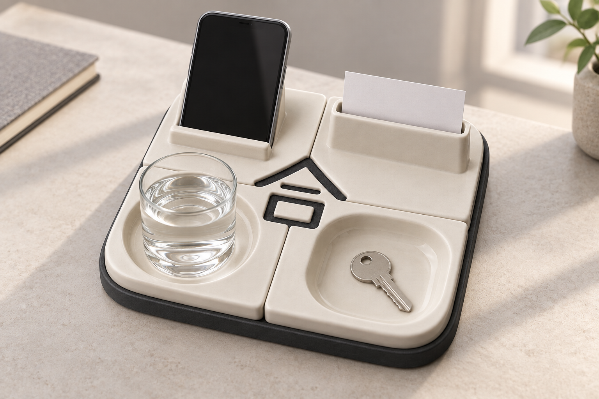

# 合礼｜参赛效果图 V1

**合** · 四种独立桌面用途，归位后形成有底的“合”字负形。

本轮完成两张 1536×1024 PNG，使用内置 image_gen 生成。供学生组方案展示与展板排版使用，未包含赛事专属文字和标识。

## 产品主视觉

## 使用或结构概念

## 本轮设计决定

杯垫、手机支架、卡片座、小物盘加一个公共底座，共五个主要部件。底座支撑口部中心岛；负形采用有底浅槽。本轮交付总成主视觉及使用场景。分件尝试因内缘轮廓漂移未采用，轮廓分割、烧成公差与独立使用稳定性仍需二维/CAD设计验证。

[完整提示词、迭代与逐图检查](生成记录.md)

[返回七题概念库](https://github.com/xym08/-AI-/tree/main/03_设计开发/04_中国礼物七题_第一轮概念库)

效果图表达设计意图，不作为实物、性能或知识产权验证证据。正式提交前按赛区要求排版并披露 AI 辅助使用。
