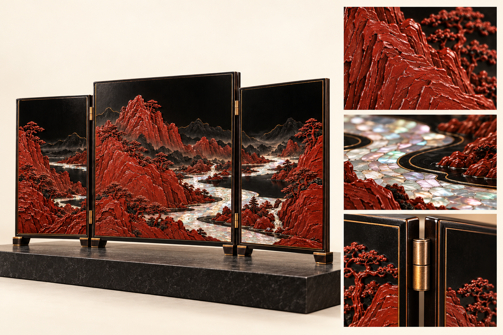

# 江山入屏｜高端陈设礼品概念

载体：**三折座屏**

拟议工艺：雕漆 · 螺钿 · 细金线

视觉气质：厚重、层叠、山水气象

## 陈设主视觉

## 工艺细节展示

[三案设计说明](../05_三案设计说明.md) · [文化与工艺参考](../04_文化与工艺参考.md) · [完整提示词与生成记录](生成记录.md) · [返回总览](../README.md)

本轮以观赏性、器物气度与材质层次为主。图片为内置 image_gen 生成的设计概念，工艺与材料为拟议方向。
