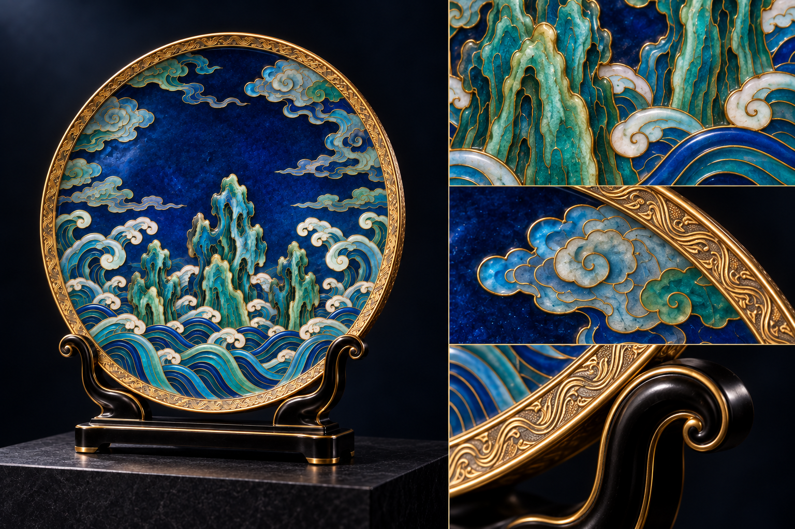

# 海晏·观澜｜高端陈设礼品概念

载体：**陈设盘**

拟议工艺：掐丝珐琅 · 鎏金意向 · 錾刻金工

视觉气质：宝蓝青绿、华丽、庄重

## 陈设主视觉

## 工艺细节展示

[三案设计说明](../05_三案设计说明.md) · [文化与工艺参考](../04_文化与工艺参考.md) · [完整提示词与生成记录](生成记录.md) · [返回总览](../README.md)

本轮以观赏性、器物气度与材质层次为主。图片为内置 image_gen 生成的设计概念，工艺与材料为拟议方向。
