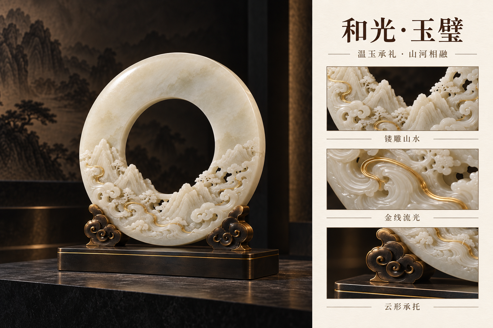

# 和光·玉璧｜高端陈设礼品概念

载体：**玉璧座雕**

拟议工艺：温白玉镂雕 · 金线 · 云形承托

视觉气质：温润、通透、礼器气度

## 陈设主视觉

## 工艺细节展示

[三案设计说明](../05_三案设计说明.md) · [文化与工艺参考](../04_文化与工艺参考.md) · [完整提示词与生成记录](生成记录.md) · [返回总览](../README.md)

本轮以观赏性、器物气度与材质层次为主。图片为内置 image_gen 生成的设计概念，工艺与材料为拟议方向。
