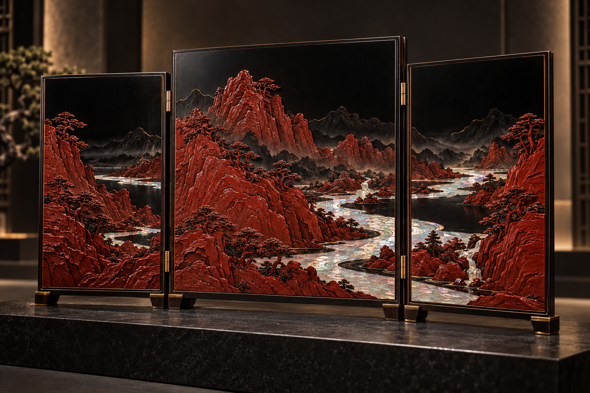
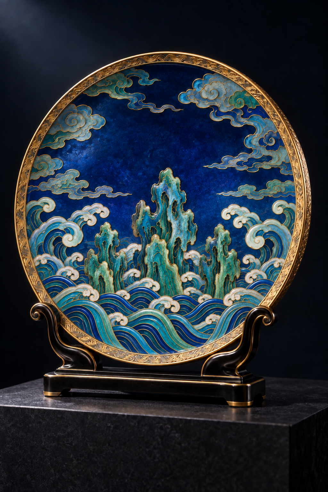
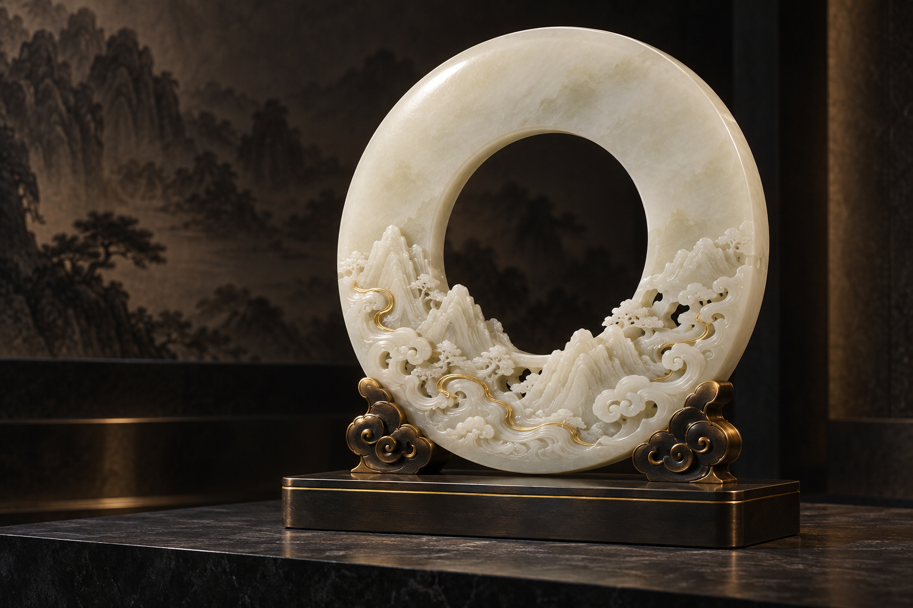

# 中国礼物｜高端陈设三案

2026-09-28 · 面向外交赠礼、收藏与重要空间陈设的概念设计

本轮优先突出精美、气度、工艺细节和中国文化辨识度，分别以座屏、珐琅盘和玉璧座雕建立三种独立方向。

| 方案 | 载体与拟议工艺 | 视觉气质 |
|---|---|---|
| [江山入屏](01_江山入屏/README.md) | 三折座屏；雕漆、螺钿与细金线 | 山河开阔，层次精微 |
| [海晏·观澜](02_海晏观澜/README.md) | 立式陈设盘；掐丝珐琅、鎏金意向与錾刻金工 | 宝蓝青绿，富丽庄重 |
| [和光·玉璧](03_和光玉璧/README.md) | 玉璧座雕；温白玉镂雕、金线与云形承托 | 温润通透，礼器气度 |

每案两张图：完整陈设主视觉 + 工艺细节展示，共 **6 张 PNG**。各目录保存完整提示词与检查记录；海晏·观澜采用修订后的 V2 纹样。

## 三案主视觉

## 浏览与说明

本地交付目录：`D:\skill\中国礼物_高端陈设三案_V1`。双击 `00_打开三案总览.html` 即可离线浏览六张图片，点击查看原图。

- [三案设计说明](05_三案设计说明.md)
- [文化与工艺参考](04_文化与工艺参考.md)
- [图片规格与校验清单](图片清单.json)

这组方案作为新增的陈设工艺品方向，与已有日用礼物系列并列保留。没有覆盖此前《瓷候》等方案。

本轮为 AI 视觉概念方案，材料与工艺表达尚非实物成果，也不表示作品已被官方作为国礼采用。正式参赛文字版式可按选定赛事继续编排。
