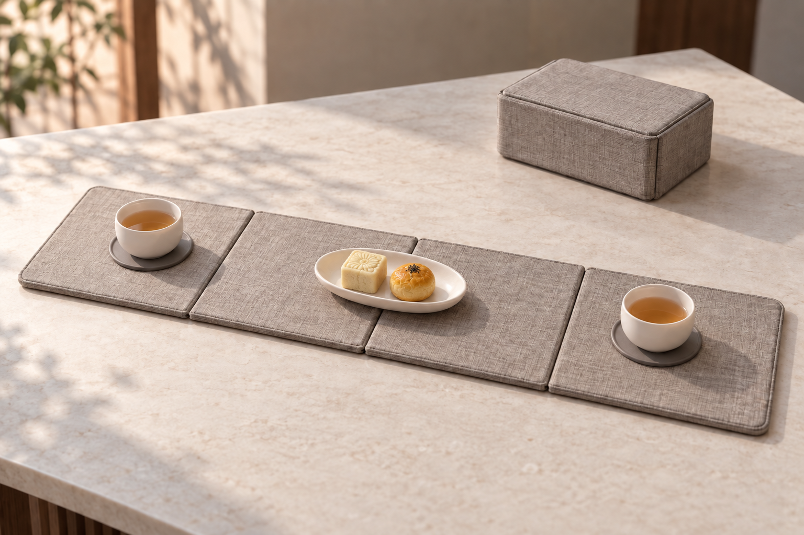
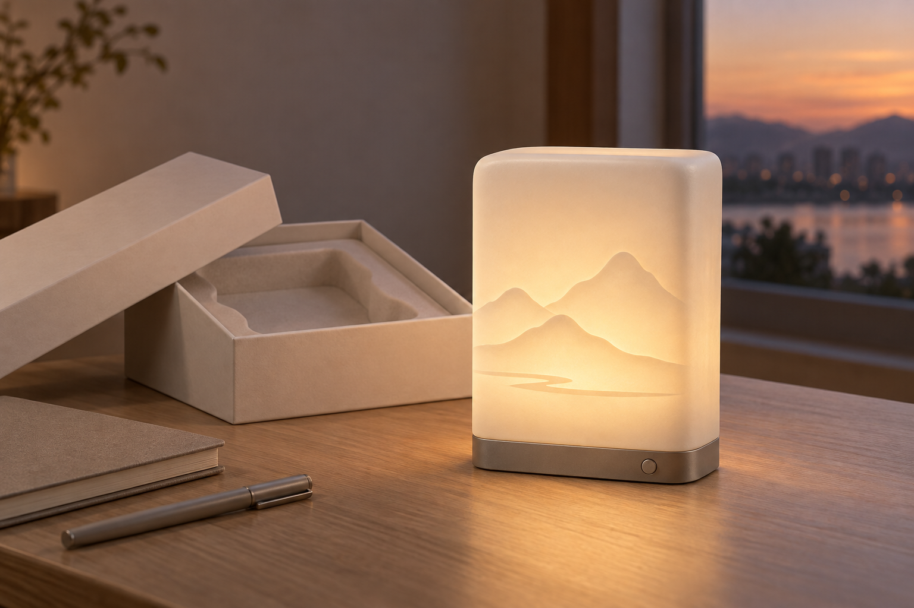
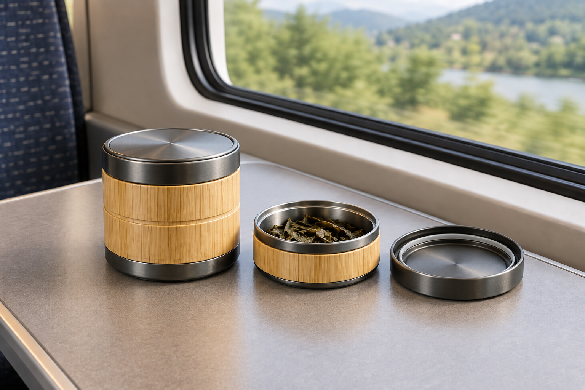
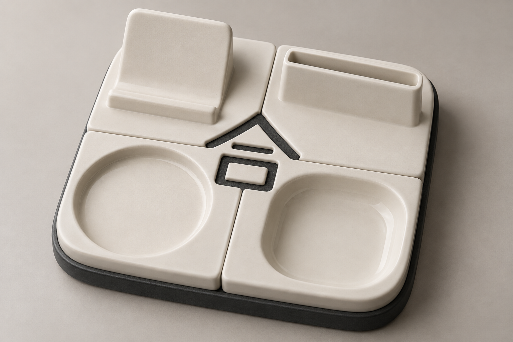

# AI视觉开发

本文件夹用于存放中国礼物项目的 AI 设计效果图、探索记录与图文展示成果。

## 最新参赛图片 · 2026-09-25

已补齐四个新方案各两张图片，共 **8 张 PNG（1536×1024）**；《瓷候》沿用已有图文成果。各目录可直接预览图片并查看完整生成记录。

| 方案 | 图片与记录 | 本轮内容 |
|---|---|---|
| 瓷候（茶与香） | [打开](01_茶与香/README.md) | 已有礼盒主视觉、结构概念、两页展板与说明 |
| 一席之间 | [打开](02_一席之间/README.md) | 新增主视觉、展开与收纳概念 |
| 白瓷光笺 | [打开](03_白瓷光笺/README.md) | 新增主视觉、关/开状态与结构概念 |
| 竹·行 | [打开](04_竹行/README.md) | 新增旅途使用主视觉、分件与洁污分区 |
| 合礼 | [打开](05_合礼/README.md) | 新增总成主视觉、桌面使用场景 |

本地统一文件夹：`D:\skill\中国礼物_参赛效果图集_V1`。内含 `00_打开图片总览.html`、12 张 PNG（8 张新增 + 瓷候已有 4 张）、瓷候两页展板 PDF 及生成记录。

《海丝·一帆》《同潮》按[七题筛选](../03_设计开发/04_中国礼物七题_第一轮概念库/README.md)暂留专项备选，本轮未生图。新增四题尚未制作赛事文字展板，未进行报名上传。

本轮《一席之间》是轻量奉茶方案（四折席面加独立盒/内托）；下方旧完整冲泡湿区版仅作为历史开发方向保留，不与新图混用。

## 历史视觉开发方向

### 01｜茶与香

重点验证：

- 旋转控香器
- 闭 / 微启 / 舒展三档状态
- 白瓷双层结构
- 无火香芯
- 香气流动路径
- 展开式香席包装
- 白瓷器物感
- 防止产品过度家电化

### 02｜一席之间

重点验证：

- 书匣式展开结构
- 左侧干区
- 中部导流区
- 右侧抽拉湿区
- 茶渣过滤
- 残水仓
- 陶瓷防碰撞
- 展开稳定性

---

## AI视觉原则

AI图片主要用于：

- 结构探索
- 造型探索
- CMF探索
- 爆炸图
- 剖面图
- 使用流程
- 包装结构
- 最终效果图

AI图片不能代替：

- 真实尺寸验证
- 工艺验证
- 材料测试
- 结构打样
- 成本验证

所有AI生成结构必须经过人工检查后才能进入下一阶段。
